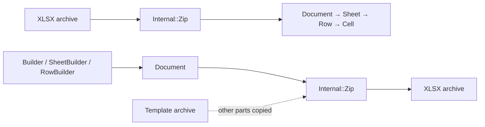

# XLSX Development

## Dependencies

1. Install `ops`, either as a gem with `gem install ops_team`, or with Homebrew
   via `brew tap nickthecook/crops && brew install ops`.
2. Without Homebrew, [install Crystal](https://crystal-lang.org/install/)
   yourself; `ops up` only installs it through Homebrew.

## Getting started

Command                         |Description                                                              
--------------------------------|-------------------------------------------------------------------------
`ops up`                        |Installs Crystal (Homebrew), installs shards and builds `bin/ameba`.     
`ops test`                      |Runs the specs, a debug build and the linter. All three must pass.       
`ops test_specs`                |Runs only the specs: `crystal spec -Dtest`.                              
`ops lint`                      |Runs `ameba` on `src/` and `samples/`.                                   
`ops build-debug` or `ops build`|Builds the `csv2xlsx` sample into `bin/debug/`.                          
`ops build-release` or `ops br` |Builds the `csv2xlsx` sample into `bin/release/`.                        
`ops run samples/<FILE>`        |Compiles and runs a sample. Without arguments, a sample prints its usage.
`ops clean`                     |Removes debug and release builds.                                        
`ops wipe`                      |Also clears the compiler cache.                                          

The samples are `csv2xlsx.cr` (convert a CSV file), `test01.cr` (print a
workbook's contents) and `test02.cr` (append a row to one sheet of a template).

### Checks CI runs

CI runs on Linux, macOS and Windows. Linux runs the debug build, the
specs and `ameba`, and fails if `crystal tool format` changes anything under
`src/`, so run the formatter before committing. Linux and macOS also make a
release build and run the `csv2xlsx` sample. `ameba` uses the baseline in
`.ameba.yml`. That file mutes findings that predate it, per rule and file;
remove an exclusion once its findings are fixed rather than adding new ones.

## How it fits together

An XLSX file is a ZIP archive of XML parts: a workbook listing the sheets, a
shared string table, a stylesheet, and one part per sheet, tied together by
relationship files. The shard turns that into a sparse, read-mostly model and
back.

- **Public API and internals.** `Document`, `Sheet`, `Row`, `Cell`, the
  `CellValue` types and the builders are public. `XLSX::Internal` holds one
  class per XML part (`WorkbookXML`, `SharedStrings`, `StylesXML`,
  `SheetXML`) and `Zip`, which orchestrates them. It is marked `:nodoc:`, so
  it is free to change.
- **Sparse, 1-based model.** Only rows and cells present in the XML exist, and
  IDs match Excel's numbering. `nil` means a cell is absent; `Empty` means
  present without a value. The two must stay distinct, because a styled blank
  cell is `Empty` and must survive a round trip.
- **Write order.** Every sheet's XML is built before the shared string table
  is written, because building a sheet is what interns its strings.
- **Templates are patched, not regenerated.** A template build replaces only
  the elements it owns (each sheet's `<sheetData>`, the workbook's `<sheets>`,
  the worksheet relationships and content types) and copies every other part
  unchanged. This is what lets a template carry charts and pivots the shard
  knows nothing about. Several places still rebuild more than they
  should; [SCOPE](./SCOPE.md) tracks them.
- **Dates.** A date is a number whose cell style displays a date, so reading
  dates depends on `styles.xml`. Times are wall-clock: offsets are discarded
  on write and values come back as UTC.

## Specs

Specs use [spectator](https://gitlab.com/arctic-fox/spectator), live in
`spec/unit/`, one file per class, and run with `-Dtest`. Most of them
round-trip through this shard's own writer, which cannot catch a mistake made
the same way on both sides; behaviour that other software must accept needs a
fixture file produced by that software.

## Working files

- [SCOPE](./SCOPE.md) is the worklist of known defects and planned work.
- [HANDOFF](./HANDOFF.md) carries conventions and current state between
  working sessions.

## Contributions

See [README](./README.md).
